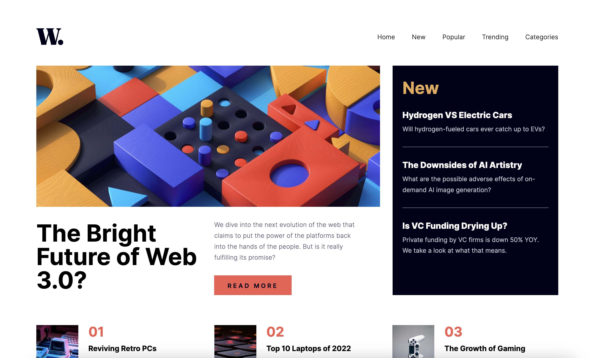

# Frontend Mentor - News homepage solution

This is a solution to the [News homepage challenge on Frontend Mentor](https://www.frontendmentor.io/challenges/news-homepage-H6SWTa1MFl). Frontend Mentor challenges help you improve your coding skills by building realistic projects.

## Table of contents

- [The challenge](#the-challenge)
- [Screenshot](#screenshot)
- [Links](#links)
- [Built with](#built-with)
- [What I learned](#what-i-learned)

### Screenshot

### Links

- Solution URL: [https://github.com/tunaerten/news-homepage]
- Live Site URL: [https://news-homepage-erten.netlify.app/]

## My process

### Built with

- Semantic HTML5 markup
- CSS custom properties
- Flexbox
- CSS Grid
- Mobile-first workflow
- JavaScript

### What I learned

It was a fun project. At first, I couldn’t decide whether to start with mobile or desktop, but I decided to start with desktop. I found it easier to design the grid system that way. I can't say I had much difficulty with the design. Although I wanted to create the mobile menu using the same list items, I had to make them separate list items due to issues I encountered with the transition
